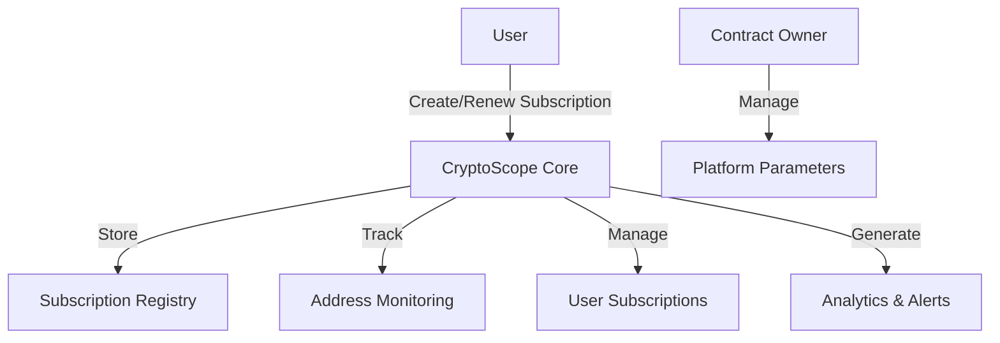

# CryptoScope On-Chain Analytics

A decentralized analytics platform for monitoring and analyzing blockchain activity on the Stacks network, providing transparent insights into wallet behaviors and smart contract interactions.

## Overview

CryptoScope is a comprehensive on-chain analytics tool that enables users to:
- Monitor specific wallet addresses
- Track transaction patterns and smart contract interactions
- Receive customized alerts for notable blockchain activities
- Access historical analytics about wallet behavior

The platform serves as a decentralized alternative to traditional blockchain explorers, with all monitoring parameters and subscription data stored on-chain for maximum transparency and reliability.

## Architecture

The CryptoScope platform is built around a subscription-based monitoring system where users can create and manage monitoring subscriptions for specific addresses.



### Core Components:
- Subscription Registry: Stores detailed subscription configurations
- Address Monitoring: Maps monitored addresses to active subscriptions
- User Subscriptions: Tracks all subscriptions owned by each user

## Contract Documentation

### CryptoScope Core Contract

The main contract managing subscription services and monitoring functionality.

#### Key Features:
- Subscription management (create, renew, update, cancel)
- Address monitoring configuration
- Usage statistics tracking
- Fee management
- Access control mechanisms

#### Access Control:
- Regular users can manage their own subscriptions
- Contract owner can adjust platform parameters and withdraw fees
- Subscription owners have exclusive rights to modify their subscriptions

## Getting Started

### Prerequisites
- Clarinet
- Stacks wallet with STX for subscription fees

### Basic Usage

1. Create a subscription:
```clarity
(contract-call? .cryptoscope-core create-subscription
    'ST1PQHQKV0RJXZFY1DGX8MNSNYVE3VGZJSRTPGZGM  ;; address to monitor
    u100                                         ;; alert frequency
    u1000000                                     ;; min transaction value
    true                                         ;; track STX transfers
    true                                         ;; track asset transfers
    false                                        ;; track contract calls
    "My first monitor"                           ;; custom notes
)
```

2. Check subscription details:
```clarity
(contract-call? .cryptoscope-core get-subscription-details u1)
```

## Function Reference

### Public Functions

1. `create-subscription`
   - Creates a new monitoring subscription
   - Requires subscription fee in STX
   ```clarity
   (create-subscription principal uint uint bool bool bool (string-ascii 256))
   ```

2. `renew-subscription`
   - Extends an existing subscription
   - Requires subscription fee in STX
   ```clarity
   (renew-subscription uint)
   ```

3. `update-subscription-parameters`
   - Modifies monitoring parameters
   ```clarity
   (update-subscription-parameters uint uint uint bool bool bool (string-ascii 256))
   ```

4. `cancel-subscription`
   - Terminates an active subscription
   ```clarity
   (cancel-subscription uint)
   ```

### Read-Only Functions

1. `get-subscription-details`
   ```clarity
   (get-subscription-details uint)
   ```

2. `get-user-subscriptions`
   ```clarity
   (get-user-subscriptions principal)
   ```

3. `get-subscription-stats`
   ```clarity
   (get-subscription-stats)
   ```

## Development

### Testing
1. Clone the repository
2. Install Clarinet
3. Run tests:
```bash
clarinet test
```

### Local Development
1. Start Clarinet console:
```bash
clarinet console
```

2. Deploy contracts:
```bash
clarinet deploy
```

## Security Considerations

### Limitations
- Maximum of 20 subscriptions per monitored address
- Maximum of 50 subscriptions per user
- Fixed subscription duration (approximately 30 days)

### Best Practices
- Always verify subscription status before relying on monitoring
- Keep subscription parameters updated for optimal monitoring
- Maintain sufficient STX balance for subscription renewals
- Review monitored address activity periodically

### Cost Considerations
- Each subscription requires a fee of 10 STX
- Fees are non-refundable for canceled subscriptions
- Consider monitoring parameters carefully to optimize costs